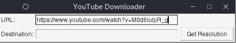

# <b style="color:green"> YouTube-Downloader </b>
A python based program created with Tkinter for UI dispay used to download streams from YouTube in form of Video and Audio

## <u>Getting Started</u>
Basically there is no complicated installations or programs you need to install. <br/>
The 
``` requirements.txt ``` should include all the libraries need in order to get the program running. They can be installed using 

``` python
pip install -r requirements.txt
```

## <u>Usage</u>
1. First, get the url of the Video or the Audio 
2. Copy the Image in the Url section <br/>
    > 
3. Enter the download location for the stream 
4. After pressing the <span style="color:gray">Get Resolution </span>button, 
5. Enter the type of stream you want to download 
    > 
6. Press the Download Button to download
